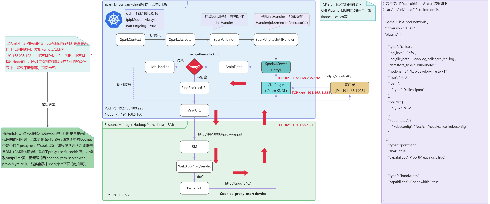

# sparkui-with-yarn-client
SparkUI visit error with yarn-client mode by deploy spark driver in k8s pod

## sparkui访问问题说明示意图

## 解决方案
 在AmIpFilter对Req的RemoteAddr进行判断是否是来自于代理的访问同时，增加判断条件：获取请求头中的Cookies中是否包含proxy-user的cookie项，如果包含则认为请求来自RM（RM发送请求时添加了proxy-user的cookie值）。修改AmIpFilter类，更新程序到hadoop-yarn-server-web-proxy-x.y.z.jar中，替换容器中spark/jars下面的包即可。
